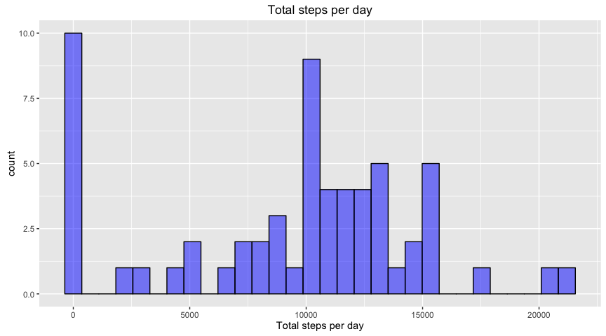

# Reproducible Research: Peer Assessment 1


## Loading and preprocessing the data
Read in the activity data set

```r
steps_df<-read.csv(unzip("activity.zip"))
```
Convert date column into Date format

```r
steps_df$date<-as.Date(as.character(steps_df$date), "%Y-%m-%d")
```


## What is mean total number of steps taken per day?
Calculate the total number of steps taken per day, ignoring missing values.

```r
library(dplyr)
total_steps_by_day <- steps_df %>% group_by(date) %>% summarize(steps=sum(steps, na.rm=TRUE))
```
Histogram of total number of steps taken each day

```r
library(ggplot2)
qplot(steps, data=total_steps_by_day, fill=I("blue"), col=I("black"), alpha=I(0.5), xlab="Total steps per day", main="Total steps per day")
```



Mean total number of steps taken per day

```r
formatC(mean(total_steps_by_day$steps, na.rm=TRUE), format="d", big.mark=',')
```

```
## [1] "9,354"
```
Median total number of steps taken per day

```r
formatC(median(total_steps_by_day$steps, na.rm=TRUE), format="d", big.mark=',')
```

```
## [1] "10,395"
```

## What is the average daily activity pattern?
Calculate the average number of steps taken in each 5-minute interval across all days

```r
average_steps_by_interval <- steps_df %>% group_by(interval) %>% summarize(steps=mean(steps, na.rm=TRUE))
```
Time-series plot of the 5-minute interval and the average number of steps taken

```r
g<-ggplot(data=average_steps_by_interval, aes(x=interval, y=steps)) 
print(g
      + ggtitle("Average Number of Steps By 5-minute Interval")
      + geom_line(colour="blue")
      + xlab("Interval")
      + ylab("Number of steps"))
```


Find which 5-minute interval contains the maximum number of steps taken (when averaged across all days)

```r
average_steps_by_interval$interval[which.max(average_steps_by_interval$steps)]
```

```
## [1] 835
```

## Imputing missing values
Calculate the total number of missing values.

```r
missing_steps<-which(is.na(steps_df$steps))
formatC(length(missing_steps), format="d", big.mark=',')
```

```
## [1] "2,304"
```
Replace missing values with the average for that 5-minute interval, in a separate copy of the activity dataset.

```r
imputed_steps_df<-steps_df
imputed_steps_df$steps[missing_steps]<-average_steps_by_interval$steps[
    match(imputed_steps_df$interval[missing_steps], average_steps_by_interval$interval)]
```

Calculate the total number of steps taken per day, from the *imputed* dataset.

```r
imputed_total_steps_by_day <- imputed_steps_df %>% group_by(date) %>% summarize(steps=sum(steps))
```
Histogram of total number of steps taken each day from the *imputed* dataset

```r
qplot(steps, data=imputed_total_steps_by_day, fill=I("blue"), col=I("black"), alpha=I(0.5), xlab="Total steps per day", main="Total steps per day")
```


Mean total number of steps taken per day from the *imputed* dataset.

```r
formatC(mean(imputed_total_steps_by_day$steps), format="d", big.mark=',')
```

```
## [1] "10,766"
```
Median total number of steps taken per day from the *imputed* dataset

```r
formatC(median(imputed_total_steps_by_day$steps), format="d", big.mark=',')
```

```
## [1] "10,766"
```
From the results above, we can see that the median and mean total number of steps taken per day for the imputed dataset, are now equal and higher than the previous values. The missing values in the original dataset, have the effect of skewing the distribution to the left. Imputing missing values with interval averages is effectively replacing zero values with these estimates instead, resulting in a more "bell-shaped" i.e. normal distribution.

## Are there differences in activity patterns between weekdays and weekends?
Add a new factor variable *dow* in the imputed dataset with two levels -- "weekday" and "weekend" -- indicating whether a given date is a weekday or weekend day.

```r
imputed_steps_df <- imputed_steps_df %>% 
    mutate(dow=factor(weekdays(date) %in% c("Saturday", "Sunday"), levels=c(FALSE, TRUE), labels=c("weekday", "weekend")))
```
Calculate the average step taken in each 5-minute interval across all weekday days and weekend days.

```r
average_steps_by_dow_and_interval<- imputed_steps_df %>% group_by(dow, interval) %>% summarize(steps=mean(steps))
```
Panel plot showing time-series plots of the 5-minute interval and the average number of steps taken averaged across all weekday days or weekend days.

```r
g<-ggplot(average_steps_by_dow_and_interval,
aes(interval,steps))
print(g + geom_line(colour="blue")
+ facet_grid(dow~.)
+ ggtitle("Average Number of Steps By 5-minute Interval")
+ ylab("Number of steps")
+ xlab("Interval"))
```


